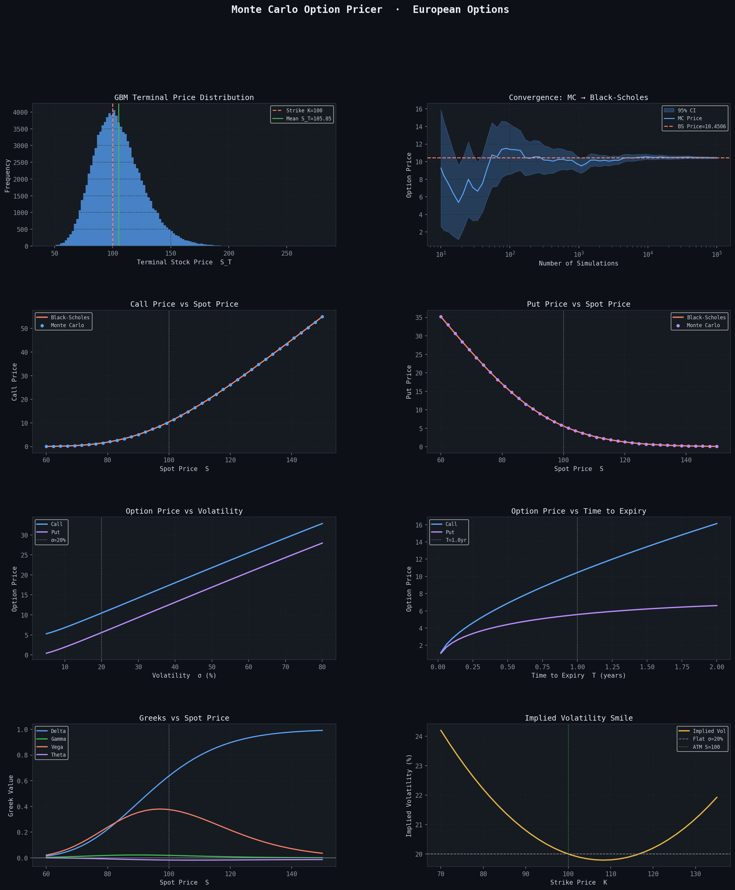

# Monte Carlo Option Pricer

Prices European call and put options using Monte Carlo simulation with Geometric Brownian Motion (GBM) path generation. Results are benchmarked against analytical Black-Scholes prices, achieving **<0.3% pricing error** at 100,000 simulations.

## Features

- **Monte Carlo simulation** — GBM terminal price paths with 95% confidence intervals
- **Black-Scholes benchmark** — analytical pricing for validation
- **Convergence analysis** — tracks MC price convergence as simulation count increases
- **Implied volatility solver** — Brent's root-finding method
- **All five Greeks** — Δ, Γ, ν, θ, ρ computed analytically
- **8-panel visualisation** — distribution, convergence, sensitivity, Greeks, IV smile

## Output

```
════════════════════════════════════════════════════
  MONTE CARLO OPTION PRICER  ·  European CALL
════════════════════════════════════════════════════
  Parameters : S=100, K=100, T=1.0yr, r=5.0%, σ=20%
  Simulations: 100,000
────────────────────────────────────────────────────
  MC Price   : 10.4205
  95% CI     : [10.3289, 10.5122]
  BS Price   : 10.4506
  Error      : 0.0300  (0.287%)
────────────────────────────────────────────────────
  Δ Delta    : +0.6368
  Γ Gamma    : +0.0188
  ν Vega     : +0.3752  (per 1% Δσ)
  θ Theta    : -0.0176  (per day)
  ρ Rho      : +0.5323  (per 1% Δr)
════════════════════════════════════════════════════
```

## Installation

```bash
pip install numpy scipy matplotlib
```

## Usage

```python
python monte_carlo_pricer.py
```

To change parameters, edit the `print_summary()` call at the bottom of the script:

```python
print_summary(
    S=100,           # Spot price
    K=105,           # Strike price (OTM call)
    T=0.5,           # 6 months to expiry
    r=0.05,          # Risk-free rate
    sigma=0.25,      # 25% volatility
    option_type="put",
    n_simulations=100_000,
)
```

## Dependencies

| Library | Use |
|---------|-----|
| `numpy` | GBM path simulation, random number generation |
| `scipy` | `norm` CDF/PDF for BS formula; `brentq` for IV solver |
| `matplotlib` | 8-panel sensitivity visualisation |

## Related Project

[Black-Scholes Options Pricer](https://github.com/michaelchak6/black-scholes-options-pricer) — analytical pricer with Greeks and IV solver that this project benchmarks against.

